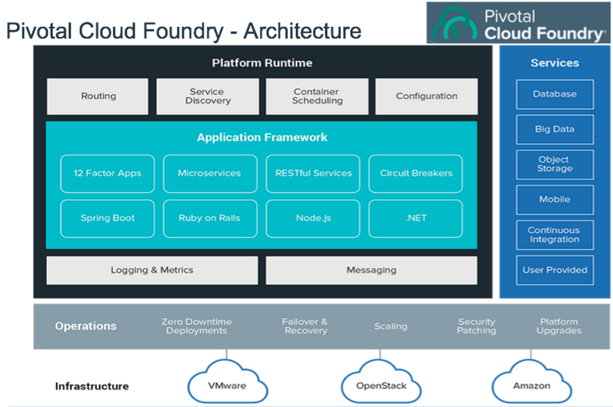

# Pcf PaaS

* Requires a considerable footprint infrastructure to run: [~30 VMS on AWS](https://docs.pivotal.io/platform/2-8/customizing/aws.html)
* Pivotal Web Services is Pivotal Platform as Service, fully managed and offers a free trial

