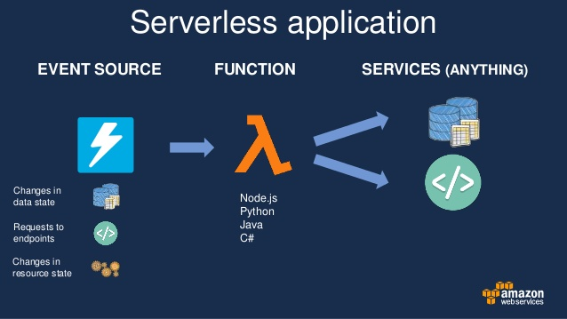

# Architecture

* An event-source: an end-points request, a file upload, a database update or a queue message posted
* A code running in a container, with restricted request execution time, CPU, and memory allowance
* Cloud infrastructure takes care of provisioning, scaling, and decommissioning

